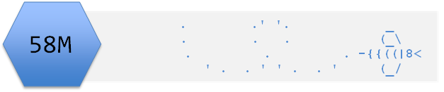

```{r setup, include=FALSE}
knitr::opts_chunk$set(echo = TRUE,
                      message = FALSE,
                      warning = FALSE)
```


# Introduction

## Aims


## Learning outcomes 

The successful student will be able to:

* use RStudio projects to appropriately organise a piece of work  
* write code with relative paths given appropriate to your organisation  
* create user-defined functions and call them  
* write plain text and image files  
* give an overview of their assessment project  

# Topics

## Project Organisation
Project: a discrete piece of work which may have a number of files associated with it such as data, several scripts for analysis or production of the output (application, report etc).

### Directory structure  

* directory just means folder  
* top level is named for the project  
* contains separate directories to organise your work  
* develop a style: e.g., consistent folder names between projects, lower case, snake_case  

<pre><code>
|--stem_cell_proteomics  
    |--data  
       |--raw  
       |--processed  
    |--analysis  
       | 
       |--accessory  
    |--figures  
</code></pre> 


## Paths 

*  the location of a filesystem object (i.e., file, directory or link)  
*  Absolute path or Full path: from the root directory of the object  
  * windows: M:/web/58M_BDS_2019/data/beewing.txt  
  * unix systems: /users/er13/web/58M_BDS_2019/data/beewing.txt  
  * web: http://www-users.york.ac.uk/~er13/58M_BDS_2019/data/beewing.txt  
*  
*  

## Using RStudio projects

An RStudio project is associated with a directory. 

You create a new project with File | New Project...


what that means for the paths

## Writing files

* why
* processed_data graphics

### Plain text files

### Graphics

### An introduction to writing functions

* Imagine there is no inbuilt function to calculate the mean. 
* We are going to write our own function to calculate the mean to demonstrate the principle of function writing on a simple example.
* We will use data in [beewing.txt](../data/beewing.txt) which are left wing widths of 100  honey bees (mm)
* Save a copy, read it in and check the structure
```{r}
bee <- read.table("data/beewing.txt", header = TRUE)
str(bee)
``` 
If you were to calculate the mean bee wing width by hand you would sum all the values in bee$wing and divide by the total number of values. R makes this easy because it calculates things 'elementwise', i.e., it applies an operation to every element of a vector so that:
```{r}
sum(bee$wing)
```
adds up all the values. 

You should rememember this from previous work. This is unusual amongst programming languages where you often need to use a loop to iterate through a vector and is very useful where data analysis and visualisation are the main tasks.

We need to divide that sum by the length of the vector to get the mean:
```{r}
sum(bee$wing) / length(bee$wing)
```

One of the reasons R is so useful is that you can name your functions for future use. A function is defined by an assignment of the form:
  
  > `functionname <- function(arg1, arg2, ...) {expression}`

The {expression} is any R code that uses the arguments (arg1 etc) to calculate a value. In our case, we will have just one argument, the vector of values, and our expression will be that needed to calculate the mean.
```{r}
mymean <- function(v) {sum(v) / length(v)}
```
I chose `v`, as a name, arbitrarily. It doesn't matter what you call it (and it only exists inside the function when the function is called). All that matters is that the function expression describes what the function should do with the arguments passed. To call the function: 
```{r}
mymean(bee$wing)
```

Functions are useful because they generalise a process thus making it reproducible without copying and pasting.

# Exercise
The data in [chaff.txt](data/chaff.txt) are the masses of male and female chaffinches. It is organised in to two columns, `males` and `females` a format which is not normally ideal. Your task is to organise the analysis of these data.  
You need to: 

* set up an appropriate directory structure and decide on some naming and style elements that you will use consistently.
* read in the data.  
* reformat the data into 'tidy' form, i.e., one column giving the sex, another giving the mass. Write the newly formatted data to a file.   
* Write your own function for calculating the sums of squares of the whole dataset. SS(x) is the sum of the squared deviations from the mean given by:  
    $\sum (x_i- \bar{x})^2$  
  Put the code for the function in its own script and call it from your main script.  
* carry out a statistical test on the data and record the result in comments.  
* create and save a figure to accompany the statistical result.
* can you format the figure using your own ggplot theme? You can achieve this by:  
  * examining the code for theme_gray() (the default) by typing `theme_gray` without the brackets  
  * copying and saving the code theme_gray in its own script called, for example, theme_emma.R  
  * changing theme elements as you wish  
  * sourcing your theme script and applying  


# The Rmd file
Answers can be found where there are labels which say
`#---SUGGESTED ANSWER---` 

[Rmd file](01_project_organisation.Rmd)




